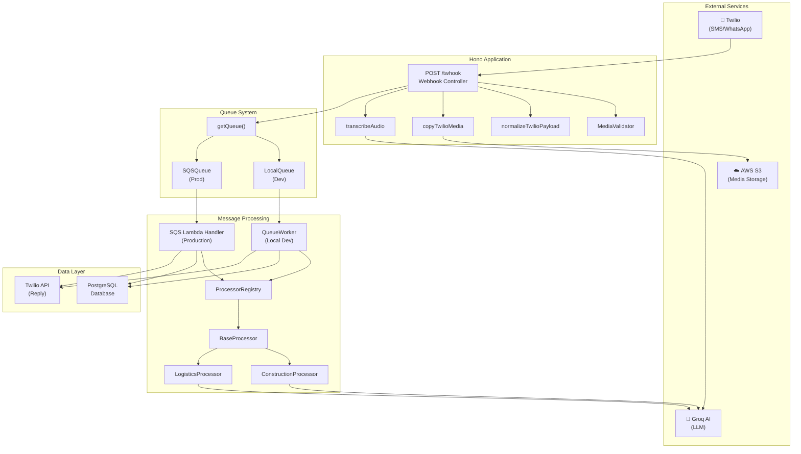
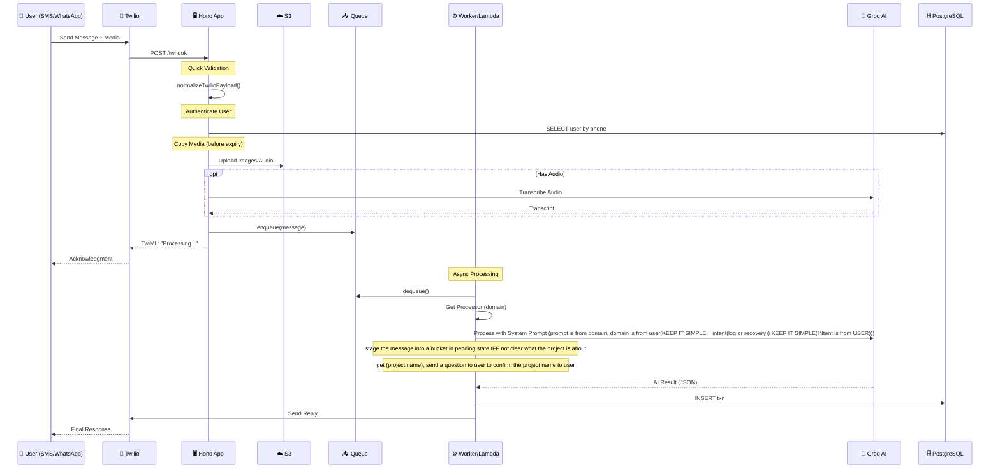
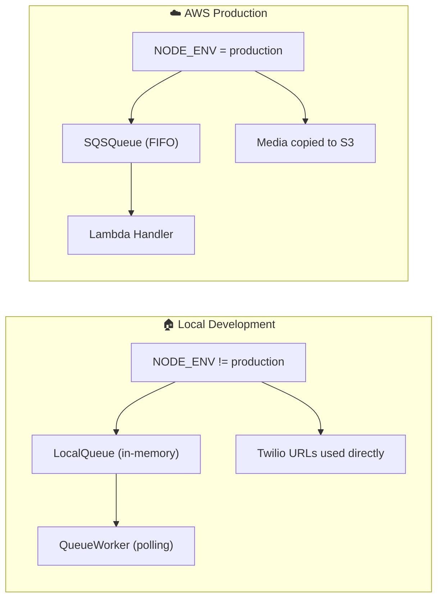
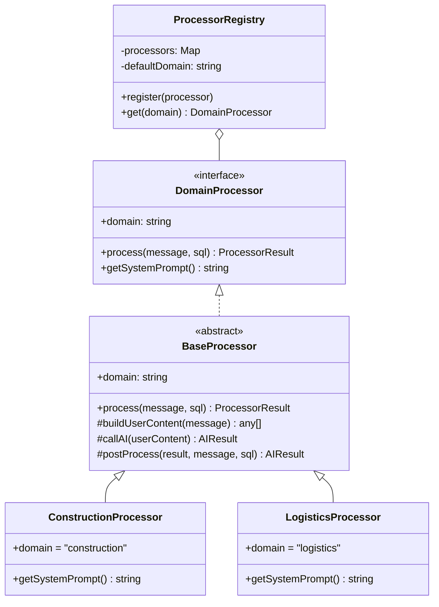

# JTXField System Architecture

## Overview

JTXField is an asynchronous media processing application built with Hono (TypeScript) that handles SMS and WhatsApp messages via Twilio webhooks. It performs AI-powered domain-specific processing using Groq LLM and supports both local development and AWS production environments.

---

## System Architecture Diagram



---

## Request Flow Diagram



---

## Component Details

### Entry Points

| File | Description |
|------|-------------|
| [index.ts](file:///Users/rahulv/sw/jtxfield/src/index.ts) | Main entry point. Starts Hono server and local QueueWorker |
| [app.ts](file:///Users/rahulv/sw/jtxfield/src/app.ts) | Hono app setup with `/twhook` route |

### Controllers

| File | Description |
|------|-------------|
| [webhook.ts](file:///Users/rahulv/sw/jtxfield/src/controllers/webhook.ts) | Handles Twilio webhooks: validates, copies media, transcribes audio, queues message |

### Services

| File | Description |
|------|-------------|
| [mediaStorage.ts](file:///Users/rahulv/sw/jtxfield/src/services/mediaStorage.ts) | Copies Twilio media to S3 before URLs expire |
| [transcribe.ts](file:///Users/rahulv/sw/jtxfield/src/services/transcribe.ts) | Audio transcription via Groq |
| [twilio.ts](file:///Users/rahulv/sw/jtxfield/src/services/twilio.ts) | Sends SMS/WhatsApp replies via Twilio API |
| [ai.ts](file:///Users/rahulv/sw/jtxfield/src/services/ai.ts) | Legacy AI parsing service |

### Queue System

| File | Description |
|------|-------------|
| [types.ts](file:///Users/rahulv/sw/jtxfield/src/queue/types.ts) | Queue interface and message types |
| [index.ts](file:///Users/rahulv/sw/jtxfield/src/queue/index.ts) | Queue factory (`getQueue()`) |
| [LocalQueue.ts](file:///Users/rahulv/sw/jtxfield/src/queue/LocalQueue.ts) | In-memory queue for local dev |
| [SQSQueue.ts](file:///Users/rahulv/sw/jtxfield/src/queue/SQSQueue.ts) | AWS SQS queue for production |

### Processors

| File | Description |
|------|-------------|
| [BaseProcessor.ts](file:///Users/rahulv/sw/jtxfield/src/processors/BaseProcessor.ts) | Abstract base with shared AI logic |
| [ConstructionProcessor.ts](file:///Users/rahulv/sw/jtxfield/src/processors/ConstructionProcessor.ts) | Construction domain prompts |
| [LogisticsProcessor.ts](file:///Users/rahulv/sw/jtxfield/src/processors/LogisticsProcessor.ts) | Logistics domain prompts |
| [ProcessorRegistry.ts](file:///Users/rahulv/sw/jtxfield/src/processors/ProcessorRegistry.ts) | Domain→Processor mapping |

### Workers & Handlers

| File | Description |
|------|-------------|
| [QueueWorker.ts](file:///Users/rahulv/sw/jtxfield/src/workers/QueueWorker.ts) | Local polling worker for dev |
| [sqsHandler.ts](file:///Users/rahulv/sw/jtxfield/src/handlers/sqsHandler.ts) | AWS Lambda SQS handler for prod |

---

## Environment-Specific Behavior



---

## Processor Class Hierarchy



---

## Key Technologies

| Technology | Purpose |
|------------|---------|
| **Hono** | Lightweight web framework |
| **TypeScript** | Type-safe JavaScript |
| **Groq SDK** | AI inference (Llama 4) |
| **Twilio** | SMS/WhatsApp messaging |
| **AWS S3** | Media storage |
| **AWS SQS** | Production queue |
| **AWS Lambda** | Serverless processing |
| **PostgreSQL** | Database (Drizzle ORM) |
| **esbuild** | Lambda bundling |

---

## Adding a New Domain

1. Create `src/processors/MyDomainProcessor.ts`:
```typescript
import { BaseProcessor } from './BaseProcessor.js';

export class MyDomainProcessor extends BaseProcessor {
    readonly domain = 'mydomain';

    getSystemPrompt(): string {
        return `You are a MyDomain assistant...`;
    }
}
```

2. Register in [ProcessorRegistry.ts](file:///Users/rahulv/sw/jtxfield/src/processors/ProcessorRegistry.ts):
```typescript
import { MyDomainProcessor } from './MyDomainProcessor.js';
// In constructor:
this.register(new MyDomainProcessor());
```
