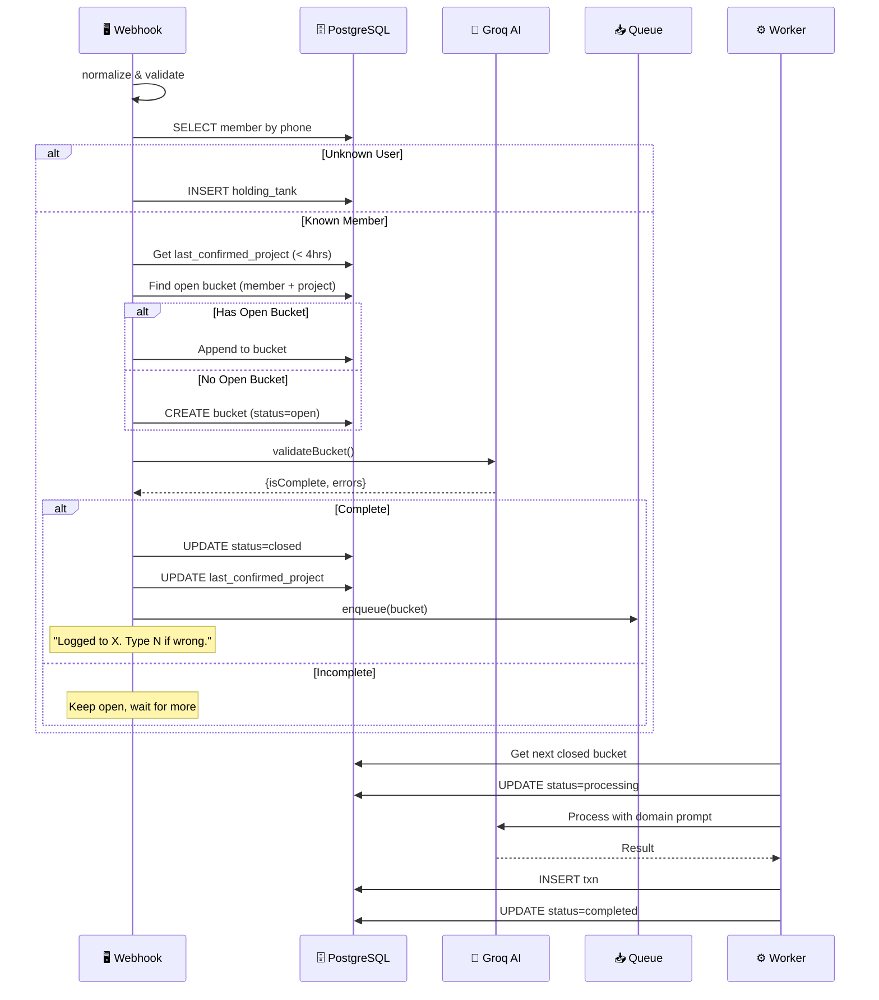
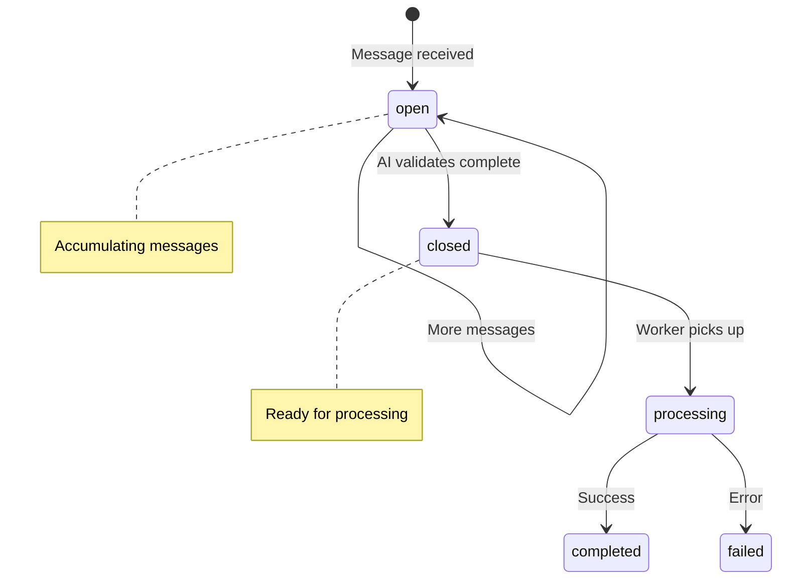

# Async Message Processing Flow

Internal system flow for bucket-based message accumulation and processing.

## Bucket States

## Key Concepts

| Concept | Description |
|---------|-------------|
| **Last Project** | Member's project confirmed < 4 hours ago |
| **Open Bucket** | Accumulating messages, not yet complete |
| **Closed Bucket** | AI validated, ready for queue |
| **Holding Tank** | Unknown users for admin review |

## Constraints (MVP)

| Constraint | Limit | Post-MVP |
|------------|-------|----------|
| **Bucket timeout** | 30 min | Cron to close stale buckets |
| **Images per bucket** | 5 max | - |
| **Project correction** | Retroactive fix if "N" after queue | - |